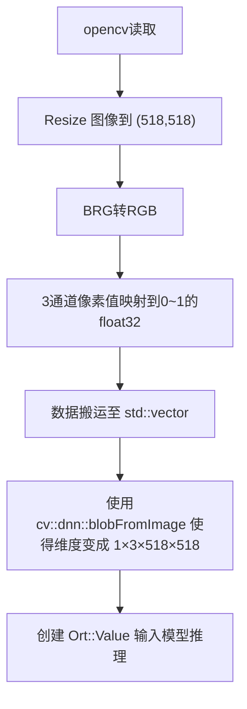
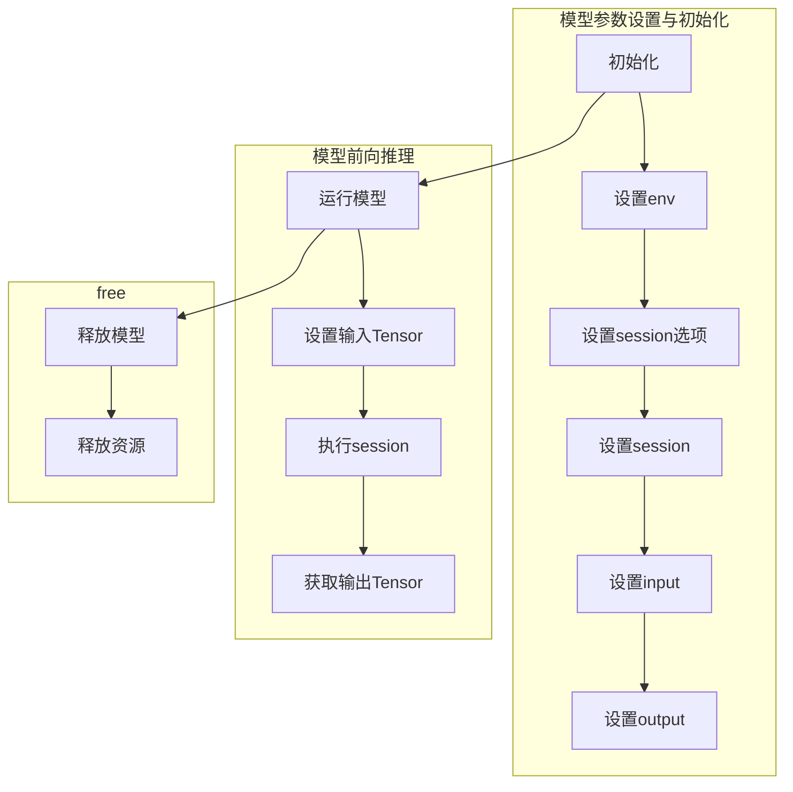

# Depth-Anything v2 OnnxRuntime c++ 部署教程

### Intro
[Depth-Anythin v2](https://github.com/DepthAnything/Depth-Anything-V2) 的源码开源之后，3 months 已经收货了 3k 的star数，可谓是单目深度估计的最火热的模型之一，此深度估计方法可作为一些slam 任务和 embodied AI task 的 depth input。
因此使用 OnnxRuntime, TensorRT 等框架对模型进行加速提高帧率是有意义的。本文将介绍使用 OnnxRuntime 对作者提供的 Vitb 模型进行部署。笔者在部署过程中踩了一些坑，在这里记录下来，希望可以帮助其他人。

### 导出 Onnx 模型
github已经有了作者写好了官方的pth模型转onnx模型，[传送门](https://github.com/fabio-sim/Depth-Anything-ONNX/tree/main)。可以直接运行 ```export.py```，选择想要的模型文件。我选择导出的是 vitb 模型（参数量为371m，不至于太大,精度不至于太低）
```
python3 export.py --model b --opset 18 --precision float32
```
### 数据预处理 workflow


### 模型推理 workflow





### 使用 CUDA 加速
OnnxRuntime 加速提供的CUDA加速接口非常方便，只需要在 ```sessionOptions``` 中加上CUDA对应选项即可。
## Appendix
